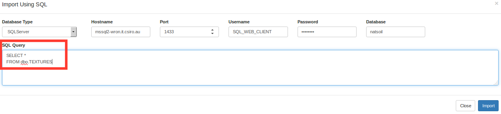
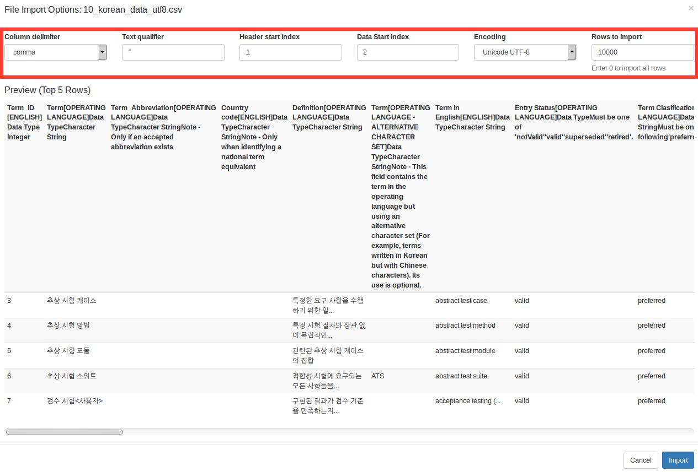

Registering Vocabularies: Karma Integration Tool
================================================================================

# Contents

  - [Introduction](#Introduction)
  - [Installation](#Installation)
  - [HowTo](#HowTo)
    - [Importing](#Importing)
    - [Settings](#Settings)
    - [Modeling](#Modeling)
    - [Exporting/Publishing](#Exporting)
  - [More](#More)


# Introduction <a id=Introduction />
This documentation present the [Karma](https://github.com/usc-isi-i2/Web-Karma) software as a suitable integration tool for vocabularies extraction and registry.

Authoritative organizations would to get advantages intern and externally of controlling (_design_) and _publishing_ their common terminology and concepts. It helps on clarity, reusability and mainly increase the effectiveness of the communication once everyone know exactly what it have been talked about.

The flowchart bellow illustrates the whole process.


The [Linked Data Registry](https://github.com/UKGovLD/registry-core/wiki) creates an administrative and versioning layer on top of RDF linked data triple stores in order to enable publish, management and access to controlled business (domain) entities and terminologies (vocabularies).

More info available in the [Linked Data Registry - Training Slides](http://www.slideshare.net/der42/registry-technical-training)

The common and hardest part is exactly the design. In other words it consists in select collections of concepts, attribute them URIs and mapping them accordingly at least a simple knowledge organization system ([SKOS](https://www.w3.org/2004/02/skos/)). Most of the times the concepts are diffused into spreadsheets or databases schemas and their extraction involves lots of work.

As initially proposed, the extraction, transforming and loading (ETL) process was made by using some intermediate steps as can be seen bellow.


Data was extracted from the databases (RDBMS) into CSV files which could be imported and easily handled by spreadsheet softwares for transforming, cleaning, and include URIs. An intermediate software such as [RDF123](http://ebiquity.umbc.edu/project/html/id/82/RDF123) was used to perform the concept modeling/alignment. If was the case, the initial RDF should be edited _by hand_. Finally the standard (proprietary) RDF tool TopBraid is used to generate the deliverable RDF for publish.

The proposal of this pipeline is to replace potentially all these intermediate tools (green box) for Karma. It allows users to connect and import data directly from multiple database and file sources, perform many transformations, make a visual model using preloaded ontologies, save/document the models and export the data into many formats including RDF (continuous red box).


# Installation <a id=Installation />

To easy get the Karma running, this repository offer a simple base for its configuration and install. For that two premisses are important to be considered. First, Karma will run over a Docker container. For more info about the [Docker](https://www.docker.com) virtual machines, please take a look on [this](https://confluence.csiro.au/display/EI/Learn+about+Docker) or [this](https://confluence.csiro.au/display/atsda/Docker+Notes) CSIRO resources. Second, consider your disk space. Once built, Karma will consume about 1.8Gb of your disk space. If you have decided to proceed from here you need to clone this repository and move to the project directory.

```
$ git clone https://github.com/preinh/karma-config-base.git
$ cd karma-config-base
```

And then build the Docker image that will called `karma`. Please do not worry about how much time it will take, it is really time-consuming.

```
$ docker build -t karma .
```

Once you had built the image, you need just to start container which will run the service.

```
$ docker run -it -p 8088:8080 --name karma_container karma
```

Please note that by default the Karma web integrator will run over Jetty service on container port 8080. To access from the host (your) machine you need properly set the host port using the `-p` option. Its syntax looks like `-p <host_port>:<container_port>`.

# HowTo <a id=HowTo />

If everything as well done and nothing was changed you probably can access the service in you local machine going to the following address.

[```http://localhost:8088```](http://localhost:8088)


## Importing <a id=Importing />

To properly work with Karma the first step is import your data. For that there is many available options. There is some of that.  

You can import directly a whole table in your database using **Import database table** option from the _Import_ menu and provide the connection parameters.


It is also possible use a specific SQL query to select only the interest fields from one or more table. **Import using SQL** let us do that.



One of the most common features is to import data from a file using **import from file** option.


The file import option able us to import ontologies for modeling purposes as well. Some of them was already configured to be preloaded (look at the [preloaded script](https://github.com/preinh/karma-config-base/blob/master/preloaded_ontologies_download.sh) in this repository).

In the case of a CSV file it is possible to choose some parameters as the separator, header lines, text encoding and others.




## Settings <a id=Settings />

Once data had been imported, it is possible to start with the model procedures. Is suggested to **set up the base URI**, the prefix and the name for your collection.


From the dataset menu it is possible to get access to some operations. Look at [Karma wiki documentation](https://github.com/usc-isi-i2/Web-Karma/wiki) for a detailed explanation.


For each data column its possible to access the column menu which allow a set of operations. For practical and simple modeling purposes the most common of that are **PyTransform** and **Set Semantic Type**

With PyTransform it is possible to clean up the data let them suitable for the desired purposes using Python scripts. It is easy to check the expected result as well.


The core function of Karma is to allow definitions of the semantic type of each column and from that build up a model.


## Modeling <a id=Modeling />

It is possible to use the content of the columns to define new resources of a semantic type or give them properties. Karma **learns** from previous works and also suggests some types.


After some work setting the semantic types the models could look like this.


## Exporting / Publishing <a id=Exporting />

To publish or export your modeled (future-linked) data it is necessary to use the dataset menu and choose _Publish -> RDF_ option.


It is possible to add data to a previously modeled context or create a new one. For internal identification and further modeling purposes using the Karma instance you are asked to give a name for the dataset context.


A link is created on the dataset bar to download the data.


The modeled data is written in Turtle format without prefixes. This make easy a further concatenation.

```turtle
<http://your.base.uri/clayey-coarse-sand> <http://www.w3.org/1999/02/22-rdf-syntax-ns#type> <http://www.w3.org/2004/02/skos/core#Concept> .
<http://your.base.uri/clayey-coarse-sand> <http://www.w3.org/2004/02/skos/core#prefLabel> "Clayey coarse sand"^^<http://www.w3.org/2001/XMLSchema#string> .
<http://your.base.uri/clayey-coarse-sand> <http://www.w3.org/2004/02/skos/core#notation> "CKS"^^<http://www.w3.org/2001/XMLSchema#string> .
```

# More <a id=More />

For more information please consider the [Karma documentation](https://github.com/usc-isi-i2/Web-Karma/wiki).

There is some other useful resources as the [tutorial](https://github.com/szeke/karma-tcdl-tutorial) and the  [publication](http://www.isi.edu/%7Eszekely/contents/papers/2013/eswc-2013-saam.pdf).

This tool was considered from [Tim Lebo](https://tw.rpi.edu//web/person/TimLebo)'s list of [alternative tabular converters](https://github.com/timrdf/csv2rdf4lod-automation/wiki/Alternative-Tabular-to-RDF-converters).

**Known issue:** Until the present version (2.4) of Karma, there was no way to proper handle language tags on xsd:string data formats. This was addressed on the [issue #212](https://github.com/usc-isi-i2/Web-Karma/issues/212).
