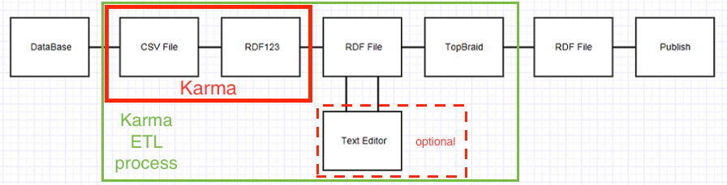
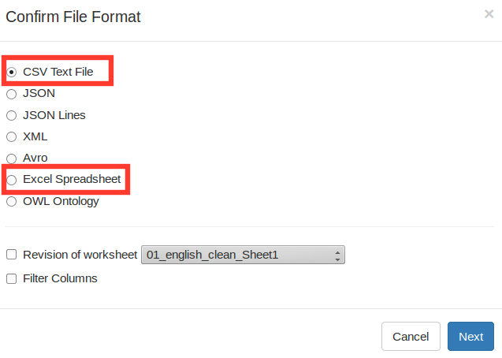
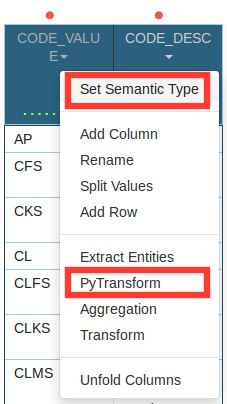
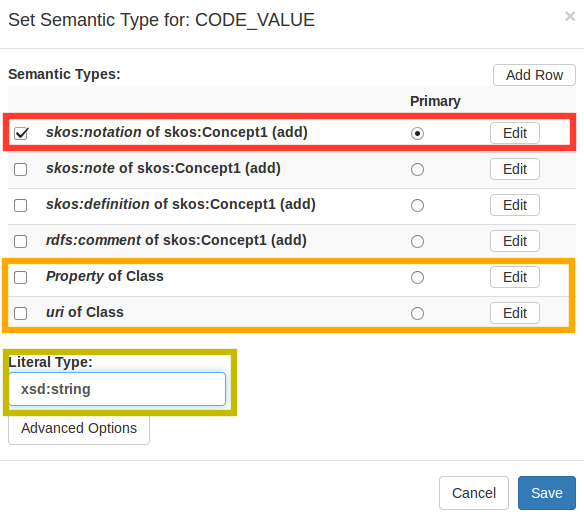
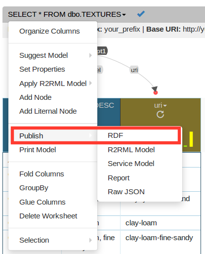
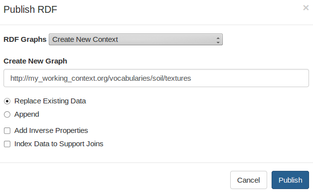

Registering Vocabularies: Karma Integration Tool
================================================================================

# Contents

  - [Introduction](#Introduction)
  - [Installation](#Installation)
  - [HowTo](#HowTo)
    - [Importing](#Importing)
    - [Settings](#Settings)
    - [Modeling](#Modeling)
    - [Exporting/Publishing](#Exporting)


# Introduction <a id=Introduction />
This documentation present the [Karma](https://github.com/usc-isi-i2/Web-Karma) software as a suitable integration tool for vocabularies extraction and registry.

Authoritative organizations would to get advantages intern and externally of controlling (_design_) and _publishing_ their common terminology and concepts. It helps on clarity, reusability and mainly increase the effectiveness of the communication once everyone know exactly what it have been talked about.

The flowchart bellow illustrates the whole process.


The [Linked Data Registry](https://github.com/UKGovLD/registry-core/wiki) creates an administrative and versioning layer on top of RDF linked data triple stores in order to enable publish, management and access to controlled business (domain) entities and terminologies (vocabularies).

More info available in the [Linked Data Registry - Training Slides](http://www.slideshare.net/der42/registry-technical-training)

The common and hardest part is exactly the design. In other words it consists in select collections of concepts, attribute them URIs and mapping them accordingly at least a simple knowledge organization system ([SKOS](https://www.w3.org/2004/02/skos/)). Most of the times the concepts are diffused into spreadsheets or databases schemas and their extraction involves lots of work.

As initially proposed, the extraction, transforming and loading (ETL) process was made by using some intermediate steps as can be seen bellow.


Data was extracted from the databases (RDBMS) into CSV files which could be imported and easily handled by spreadsheet softwares for transforming, cleaning, and include URIs. An intermediate software such as [RDF123](http://ebiquity.umbc.edu/project/html/id/82/RDF123) was used to perform the concept modeling/alignment. If was the case, the initial RDF should be edited _by hand_. Finally the standard (proprietary) RDF tool TopBraid is used to generate the deliverable RDF for publish.

The proposal of this pipeline is to replace potentially all these intermediate tools (green box) for Karma. It allows users to connect and import data directly from multiple database and file sources, perform many transformations, make a visual model using preloaded ontologies, save/document the models and export the data into many formats including RDF (continuous red box).


# Installation <a id=Installation />

Docker


# HowTo <a id=HowTo />

[```http://localhost:8080```](http://localhost:8080)


## Importing <a id=Importing />





## Settings <a id=Settings />





## Modeling <a id=Modeling />




## Exporting / Publishing <a id=Exporting />






```turtle
<http://your.base.uri/clayey-coarse-sand> <http://www.w3.org/1999/02/22-rdf-syntax-ns#type> <http://www.w3.org/2004/02/skos/core#Concept> .
<http://your.base.uri/clayey-coarse-sand> <http://www.w3.org/2004/02/skos/core#prefLabel> "Clayey coarse sand"^^<http://www.w3.org/2001/XMLSchema#string> .
<http://your.base.uri/clayey-coarse-sand> <http://www.w3.org/2004/02/skos/core#notation> "CKS"^^<http://www.w3.org/2001/XMLSchema#string> .
```
